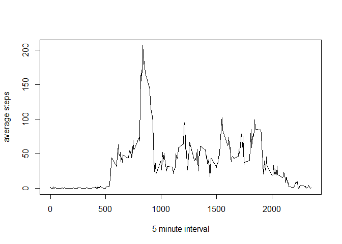

# Reproducible Research: Peer Assessment 1


## Loading and preprocessing the data

Load the required packages.


```r
library(utils)##Required for unzipping the zip file
library(dplyr,warn.conflicts = FALSE)
```

Unzip the "activity.zip" datafile.


```r
unzip('activity.zip') ## Unzip the file
```

Load the "activity.csv" and look at the column names, structure and first rows of the dataset.


```r
activity<-read.csv('activity.csv') #Load CSV
names(activity) #Look at the names of the variables
```

```
## [1] "steps"    "date"     "interval"
```

```r
str(activity) #Look at the structure of the variables
```

```
## 'data.frame':	17568 obs. of  3 variables:
##  $ steps   : int  NA NA NA NA NA NA NA NA NA NA ...
##  $ date    : Factor w/ 61 levels "2012-10-01","2012-10-02",..: 1 1 1 1 1 1 1 1 1 1 ...
##  $ interval: int  0 5 10 15 20 25 30 35 40 45 ...
```

```r
head(activity) #Look at the first few rows of the dataset
```

```
##   steps       date interval
## 1    NA 2012-10-01        0
## 2    NA 2012-10-01        5
## 3    NA 2012-10-01       10
## 4    NA 2012-10-01       15
## 5    NA 2012-10-01       20
## 6    NA 2012-10-01       25
```


## What is mean total number of steps taken per day?


####1.Calculate the total number of steps taken per day

Here we will use the dplyr package to summerize the dataset by groups. First data is grouped by date. Then summary statistics (sum), are calculated for each date. 


```r
activity_g<-group_by(activity,date) #Group by date
activity_s<-summarize(activity_g,sum=sum(steps,na.rm=TRUE)) #Calculate the total number of steps per day
```

####2.Make a histogram of the total number of steps taken each day


```r
hist(activity_s$sum,main="Histogram",xlab="Number of average daily steps",ylab="Number of days",breaks=10) #plot the histogram
```


####3.Calculate and report the mean and median of the total number of steps taken per day


```r
mean(activity_s$sum)#calculate mean
```

```
## [1] 9354.23
```

```r
median(activity_s$sum)#calculate median
```

```
## [1] 10395
```

## What is the average daily activity pattern?

####1.Make a time series plot (i.e. type = "l") of the 5-minute interval (x-axis) and the average number of steps taken, averaged across all days (y-axis)


```r
activity_g_i<-group_by(activity,interval)#group by intervals
activity_s_i<-summarize(activity_g_i,mean=mean(steps,na.rm=TRUE))#calculate the mean number of sterps for each interval
plot(activity_s_i$interval,activity_s_i$mean,type="l",xlab="5 minute interval",ylab="average steps")
```



####2.Which 5-minute interval, on average across all the days in the dataset, contains the maximum number of steps?


```r
max_mean<-max(activity_s_i$mean)
max_mean
```

```
## [1] 206.1698
```

```r
max_interval<-activity_s_i[activity_s_i$mean==max_mean,1]
max_interval
```

```
## Source: local data frame [1 x 1]
## 
##   interval
##      (int)
## 1      835
```

## Imputing missing values

####1.Calculate and report the total number of missing values in the dataset (i.e. the total number of rows with NAs)


```r
NA_rows<-is.na(activity$steps)
sum(NA_rows)##Total number of rows with NAs in steps
```

```
## [1] 2304
```

####2.Devise a strategy for filling in all of the missing values in the dataset. The strategy does not need to be sophisticated. For example, you could use the mean/median for that day, or the mean for that 5-minute interval, etc.

NA values will be replaced by the mean for that interval.


```r
activity<-left_join(activity,activity_s_i,"interval") ## average steps are added for each interval
activity<-mutate(activity,steps=ifelse(is.na(activity$steps),activity$mean,activity$steps)) ## NAs are replaced by average steps
```

####3.Create a new dataset that is equal to the original dataset but with the missing data filled in.


```r
activity<-select(activity,-mean) ## remove the mean column so the dataset is identical to the original
```

####4.Make a histogram of the total number of steps taken each day and Calculate and report the mean and median total number of steps taken per day. Do these values differ from the estimates from the first part of the assignment? What is the impact of imputing missing data on the estimates of the total daily number of steps?.


```r
activity_g<-group_by(activity,date)#group by date
activity_s<-summarize(activity_g,sum=sum(steps,na.rm=TRUE))#calculate the total number of steps per day
```

Make a histogram of the total number of steps taken each day


```r
hist(activity_s$sum,main="Histogram with NAs Filled",xlab="Number of average daily steps",ylab="Number of days",breaks=10)#create a histogram
```


Calculate and report the mean and median of the total number of steps taken per day


```r
mean(activity_s$sum)#calculate mean
```

```
## [1] 10766.19
```

```r
median(activity_s$sum)#calculate median
```

```
## [1] 10766.19
```

Both mean and median are increased by imputing NAs.


## Are there differences in activity patterns between weekdays and weekends?

####1.Create a new factor variable in the dataset with two levels - "weekday" and "weekend" indicating whether a given date is a weekday or weekend day.


```r
activity<-mutate(activity,date_class=as.Date(activity$date))#create a new variable as date class
activity<-mutate(activity,day_name=weekdays(date_class))#calculate day name
activity<-mutate(activity,day_type=as.factor(ifelse(day_name=="Saturday"|day_name=="Sunday","Weekend","Weekday")))#assign weekday or weekend factor
activity<-select(activity,steps,date,interval,day_type)#clean
```
####2.Make a panel plot containing a time series plot (i.e. type = "l") of the 5-minute interval (x-axis) and the average number of steps taken, averaged across all weekday days or weekend days (y-axis). See the README file in the GitHub repository to see an example of what this plot should look like using simulated data.


```r
activity_we<-filter(activity,day_type=="Weekend")##filter weekend
activity_wd<-filter(activity,day_type=="Weekday")##filter weekday

act_we<-group_by(activity_we,interval)##group by interval for weekend
act_su_we<-summarize(act_we,mean=mean(steps,na.rm=TRUE))##calculate average steps per interval for weekend
act_wd<-group_by(activity_wd,interval)##group by interval for weekday
act_su_wd<-summarize(act_wd,mean=mean(steps,na.rm=TRUE))##calculate average steps per interval for weekday

par(mfrow=c(1,2))
plot(act_su_wd$interval,act_su_wd$mean,type="l",main="Weekday",xlab="5 minute interval",ylab="average steps")
plot(act_su_we$interval,act_su_we$mean,type="l",main="Weekend",xlab="5 minute interval",ylab="average steps")
```


